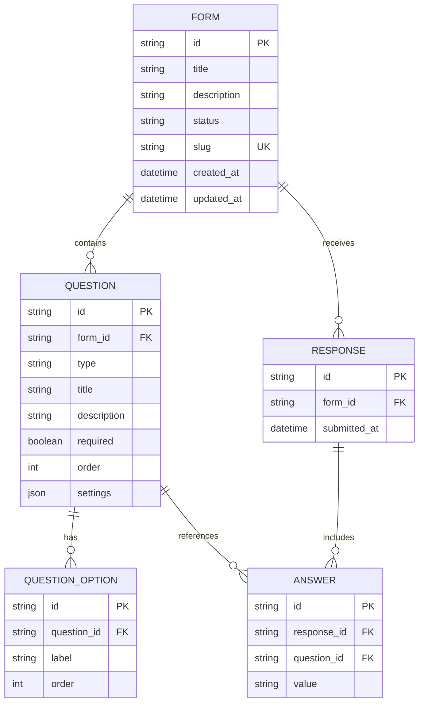

# Typeform Clone

A full-stack Typeform clone featuring a minimalist form builder, an interactive one-question-at-a-time respondent flow, a creator dashboard, and response analytics with CSV export.

---

## Tech Stack

- **Frontend**: Next.js (App Router, React 19, TypeScript), Tailwind CSS v4, `@dnd-kit` (sortable drag-and-drop).
- **Backend**: FastAPI (Python 3.11+), Uvicorn.
- **Database**: SQLite with SQLAlchemy ORM (cascade deletions, eager-loaded queries).

---

## Setup Instructions

### Prerequisites
- Node.js ≥ 18
- Python ≥ 3.11

---

### Backend Setup

1. Open a terminal in `/backend`:
   ```bash
   cd backend
   ```
2. Install Python dependencies:
   ```bash
   pip install -r requirements.txt
   ```
3. Seed the local SQLite database with sample forms, questions, and responses:
   ```bash
   python seed.py
   ```
4. Start the FastAPI development server:
   ```bash
   uvicorn main:app --reload
   ```
   The backend API will run at **http://localhost:8000** (Interactive API docs at **http://localhost:8000/docs**).

---

### Frontend Setup

1. Open a terminal in `/frontend`:
   ```bash
   cd frontend
   ```
2. Install Node dependencies:
   ```bash
   npm install
   ```
3. (Optional) Configure environment variables:
   Create a `.env.local` file if your backend runs on a different port/host:
   ```env
   NEXT_PUBLIC_API_URL=http://localhost:8000
   ```
   *Note: If omitted, `lib/api.ts` automatically defaults to `http://localhost:8000`.*
4. Start the Next.js development server:
   ```bash
   npm run dev
   ```
   The application will run at **http://localhost:3000**.

---

## Architecture Overview

The project uses a client-server architecture separating UI and API concerns:

- **Frontend (`/frontend`)**: Next.js App Router with client components managing local UI state, keyboard interactions, drag-and-drop, and optimistic updates. All API requests go through the typed `apiFetch` wrapper in [`frontend/lib/api.ts`](frontend/lib/api.ts).
- **Backend (`/backend`)**: FastAPI application divided into four modular routers registered in [`backend/main.py`](backend/main.py):
  1. **Forms Router (`routers/forms.py`)**: Creator-side form CRUD, duplicating forms, and publishing/unpublishing.
  2. **Questions Router (`routers/questions.py`)**: Question creation, updates, deletions, and drag-and-drop reordering.
  3. **Public Router (`routers/public.py`)**: Respondent-facing endpoints for fetching published forms by slug and submitting responses.
  4. **Responses Router (`routers/responses.py`)**: Response listings, detailed single-submission views, per-question aggregate statistics, and CSV export streaming.

---

## Database Schema

Defined in [`backend/models.py`](backend/models.py) across five relational models with cascade deletes:

- **`Form`**: Primary container (`id`, `title`, `description`, `status`, `slug`, `created_at`, `updated_at`).
- **`Question`**: Belongs to `Form` (1:N) (`id`, `form_id`, `type`, `title`, `description`, `required`, `order`, `settings`).
- **`QuestionOption`**: Belongs to `Question` (1:N) (`id`, `question_id`, `label`, `order`).
- **`Response`**: Belongs to `Form` (1:N) (`id`, `form_id`, `submitted_at`).
- **`Answer`**: Belongs to `Response` (1:N) and references `Question` (`id`, `response_id`, `question_id`, `value`).



---

## API Overview

### Forms Router (`/forms`)
| Method | Path | Purpose |
|---|---|---|
| `GET` | `/forms` | List all forms with question & response counts |
| `POST` | `/forms` | Create a new draft form |
| `GET` | `/forms/{id}` | Get full form detail with questions and options |
| `PUT` | `/forms/{id}` | Update form title or description |
| `DELETE` | `/forms/{id}` | Delete a form (cascades to questions & responses) |
| `POST` | `/forms/{id}/duplicate` | Deep-copy a form with all questions and reset to draft |
| `POST` | `/forms/{id}/publish` | Publish form and generate public link |
| `POST` | `/forms/{id}/unpublish` | Revert form back to draft status |

### Questions Router (`/forms/{id}/questions` & `/questions`)
| Method | Path | Purpose |
|---|---|---|
| `POST` | `/forms/{id}/questions` | Add a new question to a form |
| `PUT` | `/questions/{id}` | Update question title, required flag, settings, and options |
| `DELETE` | `/questions/{id}` | Delete a question |
| `PUT` | `/forms/{id}/questions/reorder` | Bulk reorder questions |

### Public Router (`/public`)
| Method | Path | Purpose |
|---|---|---|
| `GET` | `/public/forms/{slug}` | Fetch published form data by slug for respondents |
| `POST` | `/public/forms/{slug}/responses` | Submit answers to a published form with validation |

### Responses Router (`/forms/{id}/responses` & `/forms/{id}/stats`)
| Method | Path | Purpose |
|---|---|---|
| `GET` | `/forms/{id}/responses` | List all responses for a form with preview answers |
| `GET` | `/forms/{id}/responses/{response_id}` | Get full question/answer details for one response |
| `GET` | `/forms/{id}/responses/export` | Download all responses as a CSV file |
| `GET` | `/forms/{id}/stats` | Get aggregate statistics and ratings distribution |

---

## Supported Question Types

Implemented in [`frontend/lib/question-types.tsx`](frontend/lib/question-types.tsx):

1. **Short Text (`short_text`)**: Single-line text input.
2. **Long Text (`long_text`)**: Multi-line textarea (supports Shift + Enter for new lines).
3. **Multiple Choice (`multiple_choice`)**: Clickable choices with keyboard shortcuts (`A`, `B`, `C`...).
4. **Dropdown (`dropdown`)**: Select dropdown list.
5. **Email (`email`)**: Validated email input.
6. **Number (`number`)**: Numeric input.
7. **Yes / No (`yes_no`)**: Binary choice buttons with `Y` / `N` keyboard shortcuts.
8. **Rating (`rating`)**: Configurable scale (default 5) with custom icon shapes (*Star*, *Heart*, *Thumbs Up*, *Crown*, *Lightning*) and digit key shortcuts (`1`..`5`).

---

## Assumptions & Simplifications

- **No Authentication**: Single creator model without login or user accounts.
- **SQLite Database**: Used for zero-config local development with file persistence.
- **Auto-Generated Slugs**: 8-character unique alphanumeric slugs generated for public form URLs.
- **Text-Based Answer Storage**: All answer values are stored as strings in the `Answer.value` column, with type-specific validation enforced on the backend at submission time.

---

## Known Placeholders / Not Implemented

- Conditional logic branching and skip logic.
- Third-party integrations (webhooks, Google Sheets, email notifications).
- Team workspace permissions and multi-user collaboration.
- File upload and payment question types.
- Custom form themes and background imagery.
